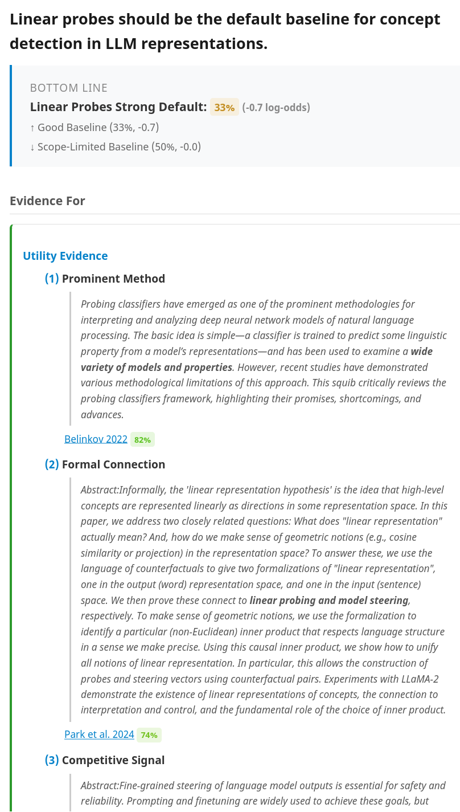

# vargdown - Verified Argument Maps

Goal: make it **hard** to the LLM to hallucinate, and **easy** for you to check.

- 1st pass: automatic verification with code
- 2nd pass: approximate verification by another agent (sub agent)
- 3rd pass: human, assisted by good UI

## Example

```argdown
===
model:
    mode: strict
===

[Umbrella]: I should bring an umbrella today.
  + <Forecast Says Rain>
  - <Clear Sky Now>

<Forecast Says Rain>

(1) [Forecast]: The weather app says 70% chance of rain this afternoon. #observation
   [weatherzone](https://www.weatherzone.com.au/wa/perth/perth)
   [evidence](evidence/202060601_weatherzone_perth.md#L53-L53)
   > Perth for Tuesday. Cloudy, **70% chance of afternoon showers**. Winds SE 20 to 30 km/h turning S/SW in the early afternoon then tending S/SE 15 to 20 km/h in the evening.
    {reason: "data provided by the Bureau of Meteorology (BOM)", credence: 0.95}
----
(2) [Rain Likely]: It will probably rain today.
    {reason: "BOM highly calibrated", inference: 0.70}
  +> [Umbrella]

<Clear Sky Now>

(1) [Blue Sky]: The sky is currently clear and blue. #assumption
    {reason: "looking out the window right now", credence: 0.95}
----
(2) [Might Stay Dry]: It may not rain after all.
    {reason: "current sky tells you almost nothing about 4pm -- weather changes fast", inference: 0.20}
  -> [Umbrella]
```

Output: `[Umbrella]` implied credence ~62% (forecast outweighs the weak con of current clear sky).

**See [SKILL.md](./SKILL.md) for a realistic example with sources and quotes.


## Principles

**Machine-check what you can; make the rest judgeable at the right level.**

- **1a. Proof travels with the claim.** Every observation exports URL + exact quote + frozen local copy (`evidence/`). The judge never searches -- it's right there.
- **1b. Observations have sources; inferences have reasons.** Each step is one or the other, never mixed. Observations are checked against their source; inferences against reasoning and stated credence.
- **1b2. Each node in the argument tree is independently verifiable at its level.** Observations (leaves): readable from the quote alone, no domain expertise or wider context needed. Inferences (branches): evaluable given only the stated premises and reason. Thesis (root): computed from the log-odds of all branches, never manually stated. Each tier is checkable by a different verifier: machine checks structure, sub-agent checks inference plausibility, human checks cruxes.
- **1c. Reason first, credence second; bottom line is computed, never stated.** State why before how-much. The top-level claim falls out of the math.

## Install as agent skill

```bash
# Claude Code / OpenCode
ln -s /path/to/this/repo ~/.claude/skills/vargdown
```

The skill file ([SKILL.md](SKILL.md)) is the single source of truth for how agents write argument maps.


## Quick start

```bash
npx @argdown/cli json examples/linear_probs.argdown examples && node verify.mjs examples/linear_probs.json examples/linear_probs_verified.html
```

Optional verify-only pass (no HTML render):

```bash
npx @argdown/cli json examples/linear_probs.argdown examples && node verify.mjs examples/linear_probs.json --verify-only
```

Open `examples/linear_probs_verified.html` in a browser to see the rendered argument map: colored cards with computed credences, clickable source links, bold-highlighted quotes, and a bottom-line number.

Requires `node` (v20+).




## How it works

0. Fetch sources into `evidence/*.md` (each with `Source:` / `Title:` headers and verbatim body)
1. Worker sub-agent writes `.argdown` file following [SKILL.md](SKILL.md) format
2. `@argdown/cli` parses `.argdown` to JSON, `verify.mjs` checks structure + computes bottom-line credence
3. Adversarial reviewer sub-agent attacks the map (load-bearing weak points, inference leaps, quote fidelity)
4. Main agent consolidates findings; human decides which changes to apply
5. Output: standalone HTML with colored cards, source links, and computed credences

See `examples/` for working argument maps. See [AGENTS.md](AGENTS.md) for the dev workflow.

## Dev

```bash
npm test          # unit tests (SKILL.md example + test_patterns/ + examples/)
```

## References

- [Argdown syntax](https://argdown.org/syntax/)
